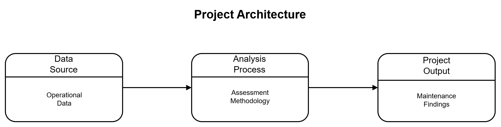
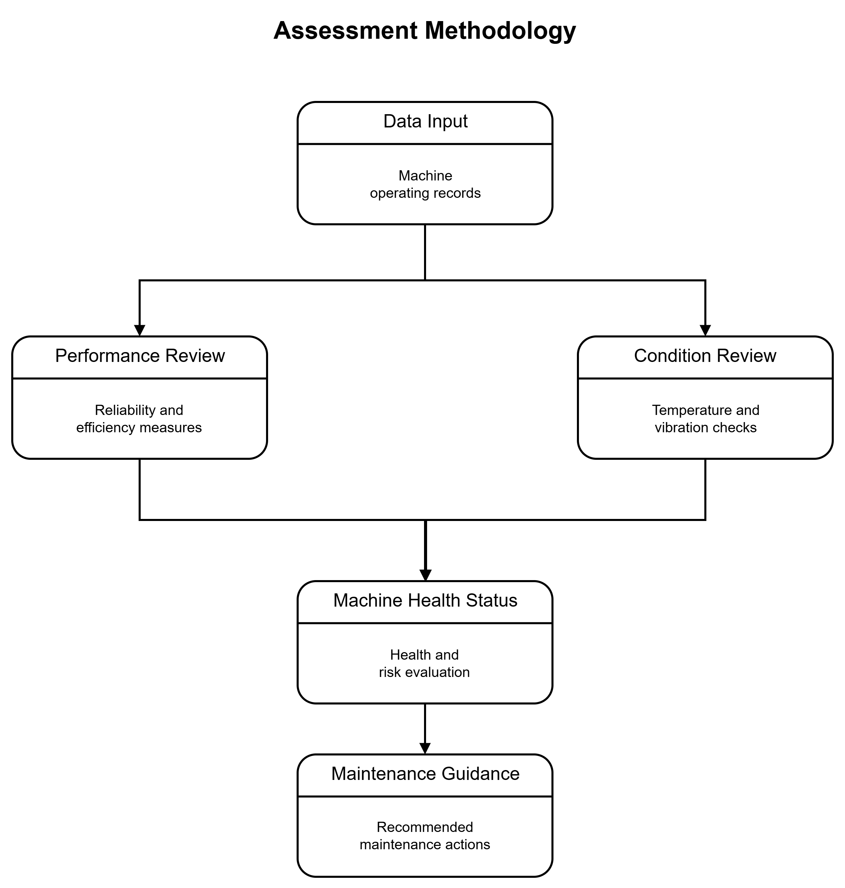
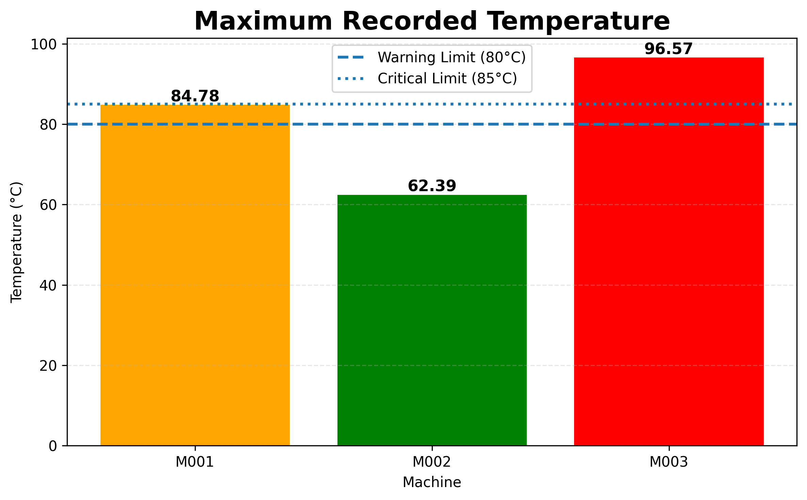
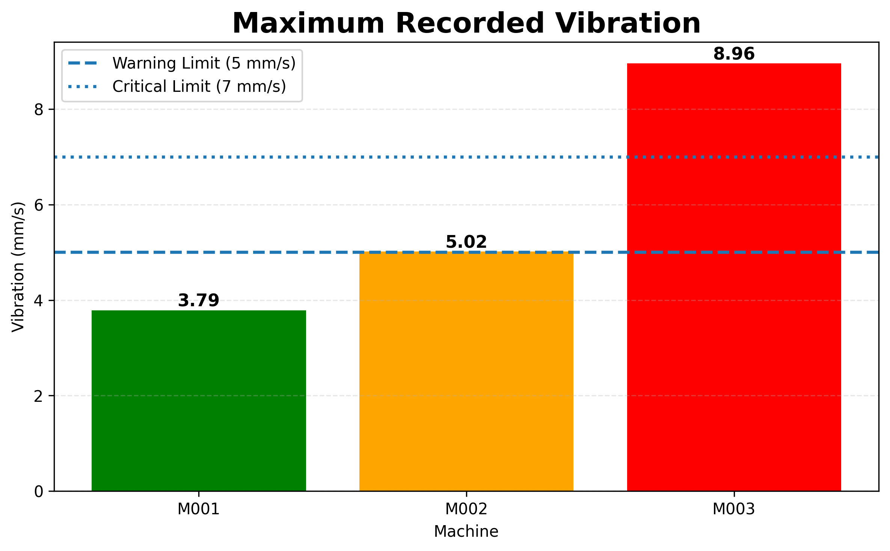
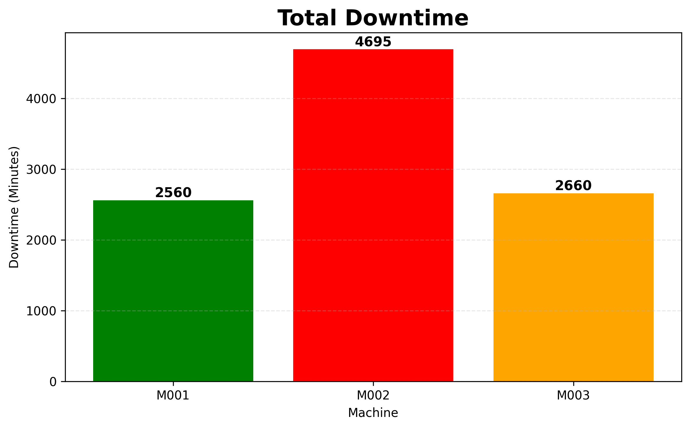
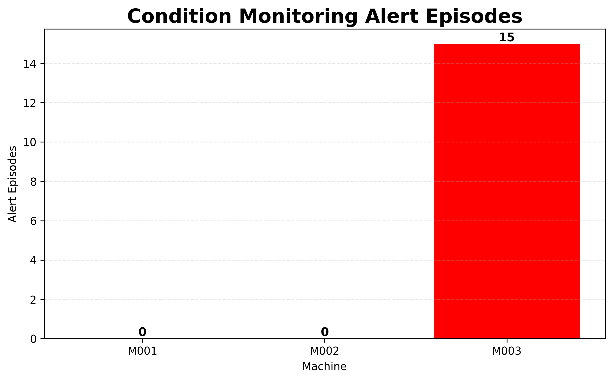
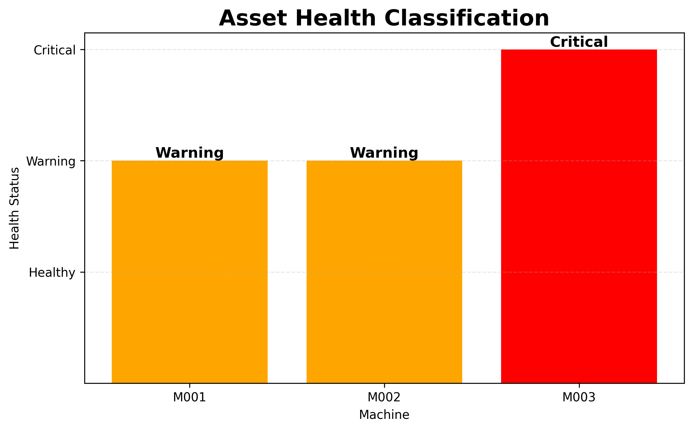

# Industrial Maintenance Analytics

Industrial equipment is expected to operate reliably, but operating conditions can change over time.

Small changes in temperature, vibration, or equipment availability may indicate developing issues long before a machine reaches a critical condition.

Understanding these changes is an important part of maintenance engineering because it helps identify problems early and supports more effective maintenance planning.

## Project Overview

Industrial Maintenance Analytics is a maintenance engineering study that examines machine operating records and converts them into maintenance findings.

The project evaluates machine performance, operating condition, machine health status, and maintenance requirements using information related to runtime, downtime, energy consumption, temperature, vibration, and maintenance activity.

A structured assessment process is used to review machine behaviour and identify maintenance needs. The resulting findings are presented through engineering reports and dashboards that summarize machine condition and maintenance priority.

The project demonstrates how machine operating records can be transformed into practical maintenance findings through data preparation, engineering evaluation, and result visualization.

## Project Objective

The objective of this project is to demonstrate how machine operating records can be used to support maintenance engineering activities.

The project was developed to illustrate how operational information can be organized and evaluated through a structured assessment process to support machine condition evaluation and maintenance planning.

By combining multiple sources of operating information, the project provides a practical example of how engineering data can be transformed into maintenance findings.

The final outcome is a set of reports and dashboards that summarize machine condition and maintenance needs.

## Project Architecture

The project follows a three-part structure consisting of a data source, an assessment process, and project outputs.

Machine operating records provide the input data for evaluation. The assessment process examines machine performance and operating condition before producing maintenance findings. The resulting findings are presented through engineering reports and dashboards.



## Assessment Methodology

The assessment methodology is used to examine machine operating records and convert them into maintenance findings.

The process combines performance review and operating condition review to evaluate machine behaviour and operating condition. Information related to reliability, efficiency, temperature, vibration, and operating interruptions is brought together during machine health evaluation.

The resulting health status is used to develop maintenance guidance and identify machines that require additional attention.



## Project Outputs

The assessment process produces reports and dashboards that summarize machine performance, operating condition, machine health status, and maintenance needs.

### Generated Reports

The project generates four reports in CSV format.

| Report                            | Description                                                                |
| --------------------------------- | -------------------------------------------------------------------------- |
| `kpi_report.csv`                  | Summary of machine performance measures and reliability indicators         |
| `condition_alerts.csv`            | Records of unusual operating conditions identified during condition review |
| `asset_health_report.csv`         | Machine health status and maintenance risk evaluation                      |
| `maintenance_recommendations.csv` | Recommended maintenance actions for each machine                           |

### Report Preview

The following tables provide a preview of selected report outputs. Complete report files are available in the results directory.

### Key Performance Indicator (KPI) Report

The KPI report includes machine performance measures and reliability indicators.

* **MTBF (Mean Time Between Failures)** represents the average operating time between failure events.
* **MTTR (Mean Time To Repair)** represents the average time required to restore a machine after a failure event.

| Machine | Availability (%) | Failure Episodes | MTBF (hrs) | MTTR (hrs) |
| ------- | ---------------- | ---------------- | ---------- | ---------- |
| M001    | 97.85            | 0                | 1943.74    | 0.00       |
| M002    | 96.13            | 0                | 1942.05    | 0.00       |
| M003    | 97.77            | 1                | 1947.31    | 44.33      |

### Asset Health Report

| Machine | Health Status | Risk Level |
| ------- | ------------- | ---------- |
| M001    | Warning       | Medium     |
| M002    | Warning       | Medium     |
| M003    | Critical      | High       |

### Generated Dashboards

The project generates five dashboards that summarize the assessment findings.

| Dashboard                    | Description                                      |
| ---------------------------- | ------------------------------------------------ |
| `01_max_temperature.png`     | Comparison of maximum machine temperatures       |
| `02_max_vibration.png`       | Comparison of maximum machine vibration levels   |
| `03_total_downtime.png`      | Comparison of accumulated machine downtime       |
| `04_alert_count.png`         | Summary of condition review alert activity       |
| `05_asset_health_status.png` | Summary of machine health status classifications |

### Dashboard Preview

#### Maximum Temperature Dashboard



#### Maximum Vibration Dashboard



#### Total Downtime Dashboard



#### Alert Episode Dashboard



#### Asset Health Status Dashboard



## Repository Structure

The repository is organized into separate directories for data storage, analysis, visualization, project outputs, project diagrams, and project documentation.

```text
industrial_maintenance_analytics
│
├── data
│   └── maintenance_data.csv
│
├── images
│   ├── assessment_methodology.png
│   └── project_architecture.png
│
├── notebook
│   └── project_walkthrough.ipynb
│
├── results
│   ├── 01_max_temperature.png
│   ├── 02_max_vibration.png
│   ├── 03_total_downtime.png
│   ├── 04_alert_count.png
│   ├── 05_asset_health_status.png
│   ├── asset_health_report.csv
│   ├── condition_alerts.csv
│   ├── kpi_report.csv
│   └── maintenance_recommendations.csv
│
├── src
│   ├── analytics
│   ├── data_preparation
│   └── visualization
│
├── .gitignore
│
├── LICENSE
│
├── main.py
│
├── README.md
│
└── requirements.txt
```

### Directory Description

| Directory / File   | Description                                                                                 |
| ------------------ | ------------------------------------------------------------------------------------------- |
| `data/`            | Contains `maintenance_data.csv`, which is the machine operating records used by the project |
| `images/`          | Project diagrams used in the README                                                         |
| `notebook/`        | Jupyter notebook containing the project walkthrough and analysis                            |
| `results/`         | Generated reports and dashboard outputs                                                     |
| `src/`             | Project source code                                                                         |
| `main.py`          | Main project entry point                                                                    |
| `requirements.txt` | Python package dependencies                                                                 |
| `README.md`        | Project documentation                                                                       |
| `LICENSE`          | Project license information                                                                 |

### Source Code Structure

The source code is organized into modules responsible for data preparation, analysis, and dashboard generation.

| Module              | Purpose                                                                                   |
| ------------------- | ----------------------------------------------------------------------------------------- |
| `data_preparation/` | Dataset generation and dataset validation                                                 |
| `analytics/`        | Performance review, condition review, machine health evaluation, and maintenance guidance |
| `visualization/`    | Dashboard creation and result visualization                                               |

## How To Run

### Prerequisites

Before running the project, ensure that the following software is installed:

* Python 3.10.10
* Git

### Project Setup

Clone the repository and navigate to the project directory.

```bash
git clone https://github.com/duttakaustav/industrial_maintenance_analytics.git
cd industrial_maintenance_analytics
```

Create a Python virtual environment.

```bash
python -m venv .venv
```

Activate the virtual environment.

#### For Windows

```bash
.venv\Scripts\activate
```

#### For Linux or macOS

```bash
source .venv/bin/activate
```

Install the required project dependencies.

```bash
pip install -r requirements.txt
```

### Execute the Project

Run the project from the repository root directory.

```bash
python main.py
```

### Generated Outputs

After successful execution, the generated reports and dashboards will be available in:

```text
results/
```

## Jupyter Notebook Walkthrough

The repository includes a Jupyter notebook that presents the study, generated outputs, and final results in a single guided document.

The notebook is intended for readers who wish to understand how the assessment findings relate to machine behaviour, operating conditions, and maintenance decisions.

### Using the Notebook

1. Launch a notebook-compatible environment such as:

   * Jupyter Notebook
   * JupyterLab
   * Visual Studio Code (VS Code)

2. Open the notebook file:

   `notebook/project_walkthrough.ipynb`

3. Select the project Python environment as the notebook kernel.

4. **VS Code users:** If prompted to install `ipykernel` when selecting the notebook kernel, complete the installation and reconnect the kernel.

5. Confirm that the kernel is active and connected before executing any notebook cells.

6. Run the notebook cells sequentially from top to bottom.

7. The notebook will display explanations, report previews, dashboard visualizations, and study findings as each section is executed.

**Note:** Readers who wish to reproduce the project outputs should first complete the setup steps described in the **How To Run** section.

### Notebook Purpose

The notebook is designed as a companion to the source code rather than a replacement for it.

Readers interested in implementation details can explore the source code modules, while readers interested in methodology, interpretation, and project results can follow the notebook as a standalone walkthrough of the study.

## Assumptions and Limitations

### Assumptions

The study was developed under the following assumptions:

* The dataset represents machine operation over a ninety-day operating period.
* Machine operating records provide sufficient information for the scope of the study.
* Temperature, vibration, runtime, and downtime provide useful indicators of machine condition, performance, and reliability.
* The engineering thresholds used in the assessment are suitable for identifying normal and abnormal operating behaviour.
* Machine health status and maintenance guidance can be developed from the operating patterns present in the dataset.
* The generated dataset contains representative examples of both normal and abnormal machine operating conditions.
* The three machine profiles provide sufficient variation for the assessment process.

### Limitations

The study was developed within the following limitations:

* The project uses synthetic operating data rather than measurements collected from physical equipment.
* The assessment results depend on the operating patterns included in the dataset.
* The study evaluates only three machines and does not represent every type of equipment found in industrial environments.
* The assessment uses fixed engineering thresholds and a limited set of operating indicators.
* Factors such as environmental conditions, equipment age, maintenance history, spare part availability, production demand, and operator practices are not considered.
* The project does not include live sensor data, real-time monitoring, machine learning techniques, or methods for predicting future failures.
* The generated maintenance guidance is intended for demonstration purposes and should not be used as a replacement for site-specific engineering evaluation.
* Maintenance decision making in real industrial environments requires additional engineering, operational, safety, and cost-related considerations that are outside the scope of this study.
